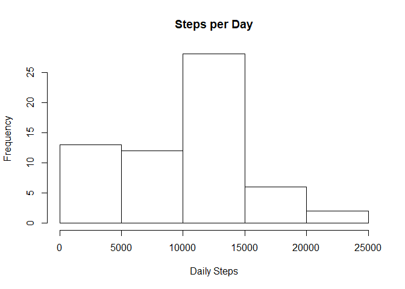
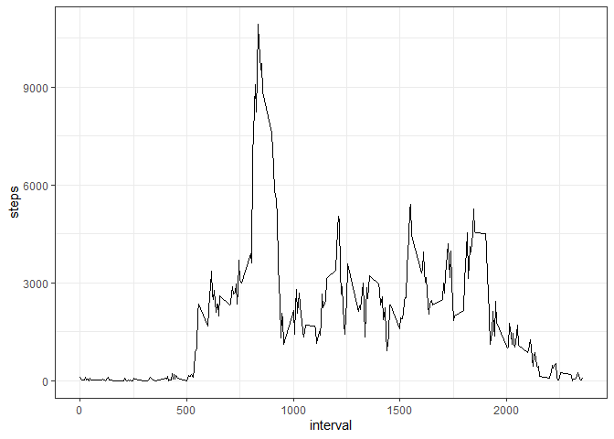
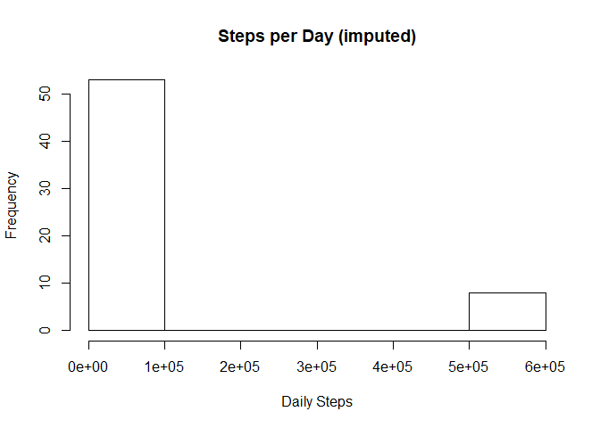
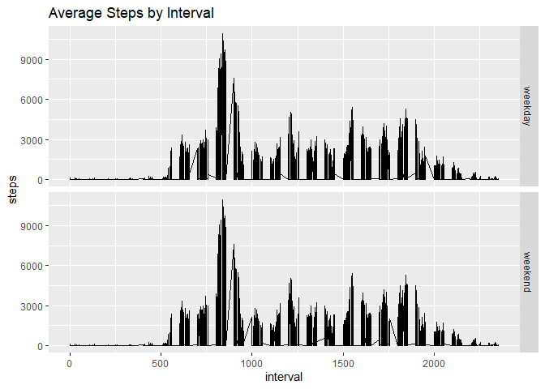

## Loading and preprocessing the data
first I need to read the data into r:


```r
unzip("activity.zip")
dataset <- read.csv("activity.csv")
```

now put the data in tbl format to work with dplyr, and load the dplyr library. Then convert the data column into data format


```r
library(dplyr)
```

```
## 
## Attaching package: 'dplyr'
```

```
## The following objects are masked from 'package:stats':
## 
##     filter, lag
```

```
## The following objects are masked from 'package:base':
## 
##     intersect, setdiff, setequal, union
```

```r
tbl_df(dataset)
```

```
## # A tibble: 17,568 x 3
##    steps date       interval
##    <int> <fct>         <int>
##  1    NA 2012-10-01        0
##  2    NA 2012-10-01        5
##  3    NA 2012-10-01       10
##  4    NA 2012-10-01       15
##  5    NA 2012-10-01       20
##  6    NA 2012-10-01       25
##  7    NA 2012-10-01       30
##  8    NA 2012-10-01       35
##  9    NA 2012-10-01       40
## 10    NA 2012-10-01       45
## # ... with 17,558 more rows
```

```r
dataset$date <- as.Date(as.character(dataset$date))
```

## What is mean total number of steps taken per day?

Create a histogram of the total number of steps per day. In order to do this, first I need to calculate the number of steps for each day


```r
daily_steps <- dataset %>% group_by(date) %>% summarize(sum(steps, na.rm=T))
names(daily_steps)[2] <- "steps"
```

now generate the histogram


```r
histogram <- hist(daily_steps$steps, xlab = "Daily Steps", main = "Steps per Day")
```

<!-- -->


Now some descriptive statistics of the number of steps taken by day


```r
summary(daily_steps$steps)
```

```
##    Min. 1st Qu.  Median    Mean 3rd Qu.    Max. 
##       0    6778   10395    9354   12811   21194
```

we can see that the average number of steps taken in a day is 9354.2295082 and the median is 10395


## What is the average daily activity pattern?

Now we will take a look at the average daily activity pattern. First by creating a time series plot of the intervals vs. the average number of steps. For this I have to average the data first by interval across all days:


```r
intervals <- dataset %>% group_by(interval) %>% summarize(sum(steps, na.rm=T))
names(intervals)[2] <- "steps"
```

now I can make the plot. For this I will use ggplot2, therefore I have to load the library first and then create the graph


```r
library(ggplot2)
g <- ggplot(intervals, aes(interval, steps))
g + geom_line() + theme_bw()
```

<!-- -->


Next it would be interesting to know in which interval on average are the most steps taken. This can be easily calculated as follows:


```r
intervals$interval[which.max(intervals$steps)]
```

```
## [1] 835
```


## Imputing missing values

first I need to calculate the number of missing values in the dataset:


```r
sum(is.na(dataset))
```

```
## [1] 2304
```

I will use the mean of the interval across all days to impute missing values to conduct the next steps of the analysis. In order to do so, I have to match the mean of the respective interval across all days to the interval of the missing value. This means I will have to merge the interval averages from the previous steps to the interval in the original dataset for those observations that are missing. This is done in the following lines of code:


```r
new_dataset <- as.data.frame(merge(dataset, intervals, by.x = "interval", by.y = "interval", all.x = T, all.y = F))
tbl_df(new_dataset)
```

```
## # A tibble: 17,568 x 4
##    interval steps.x date       steps.y
##       <int>   <int> <date>       <int>
##  1        0      NA 2012-10-01      91
##  2        0       0 2012-11-23      91
##  3        0       0 2012-10-28      91
##  4        0       0 2012-11-06      91
##  5        0       0 2012-11-24      91
##  6        0       0 2012-11-15      91
##  7        0       0 2012-10-20      91
##  8        0       0 2012-11-16      91
##  9        0       0 2012-11-07      91
## 10        0       0 2012-11-25      91
## # ... with 17,558 more rows
```

```r
names(new_dataset)[c(2,4)] <- c("steps", "av_steps")
new_dataset$steps[is.na(new_dataset$steps)] <- new_dataset$av_steps[is.na(new_dataset$steps)]
new_dataset$av_steps <- NULL
```

now with the new dataset I need to create a histogram and report the mean and the median.
First the histogram, but before, I need to generate the average number of steps per day like before:


```r
daily_steps_2 <- new_dataset %>% group_by(date) %>% summarize(sum(steps, na.rm=T))
names(daily_steps_2)[2] <- "steps"
```

now generate the histogram


```r
histogram_2 <- hist(daily_steps_2$steps, xlab = "Daily Steps", main = "Steps per Day (imputed)")
```

<!-- -->


Now I will look at the mean and the median of the new data set:


```r
summary(daily_steps_2$steps)
```

```
##    Min. 1st Qu.  Median    Mean 3rd Qu.    Max. 
##      41    9819   11458   84188   15084  570608
```


so the new average number of steps taken in a day is 8.4188066\times 10^{4} and the new median is 11458. The values significantly differ from those of the first part of the assignment. The histogram looks different, due to an exess of extreme steps and botht the mean and the median are larger due to imputation. the mean went up by 7.4833836\times 10^{4} and the median by 1063.


## Are there differences in activity patterns between weekdays and weekends?

To answer this question first I need to create a variable containing the day of the week for each date


```r
dow <- ifelse(weekdays(new_dataset$date)=="Samstag" | weekdays(new_dataset$date)=="Sonntag", "weekend", "weekday")
```

now I will create a factor variable that differentates weekends from weekdays:


```r
new_dataset$weekdays <- factor(dow)
```

finally I will create a time series graph with two panels, comparing the average steps across all days by each 5 minute interval for weekdays and weekends, but first I need to calculate the average steps by interval across al days:


```r
intervals_2 <- new_dataset %>% group_by(interval) %>% summarize(sum(steps, na.rm=T))
names(intervals_2)[2] <- "steps"
```

now for the graph I will use ggplot2.


```r
h <- ggplot(new_dataset, aes(interval, steps))
h + geom_line() +
   facet_grid(weekdays~.) +
   labs(title = "Average Steps by Interval")
```

<!-- -->


